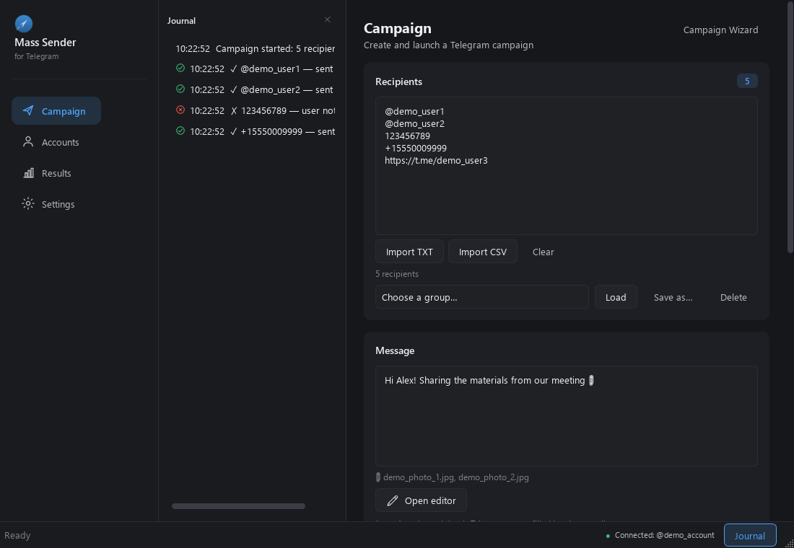
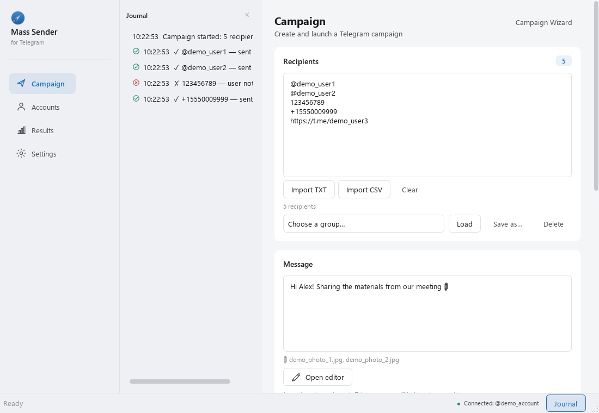
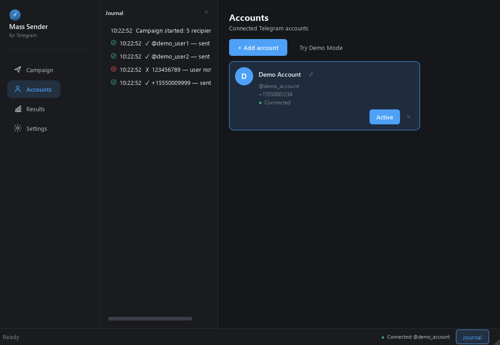
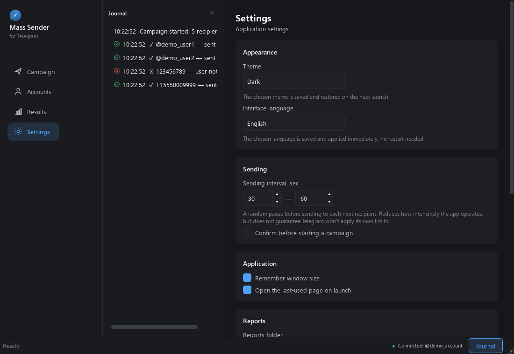
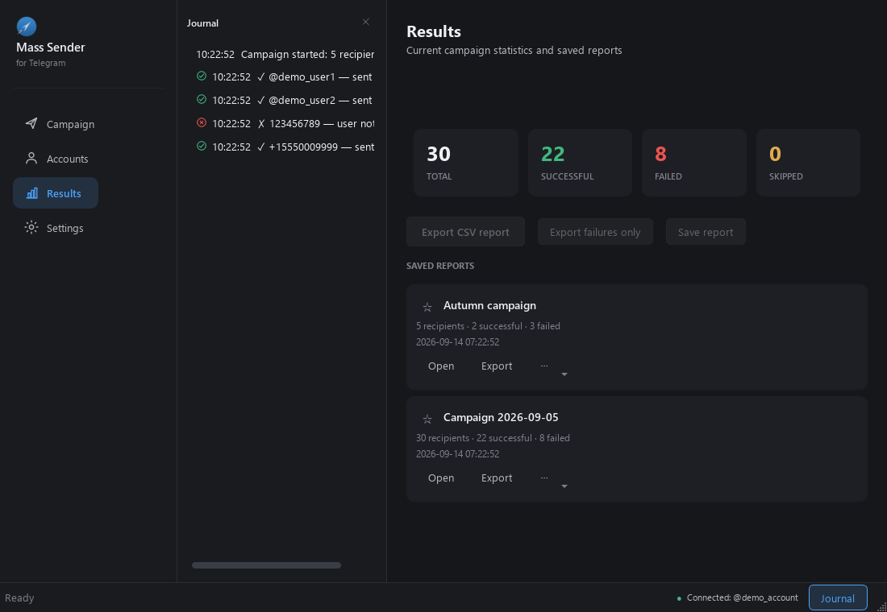
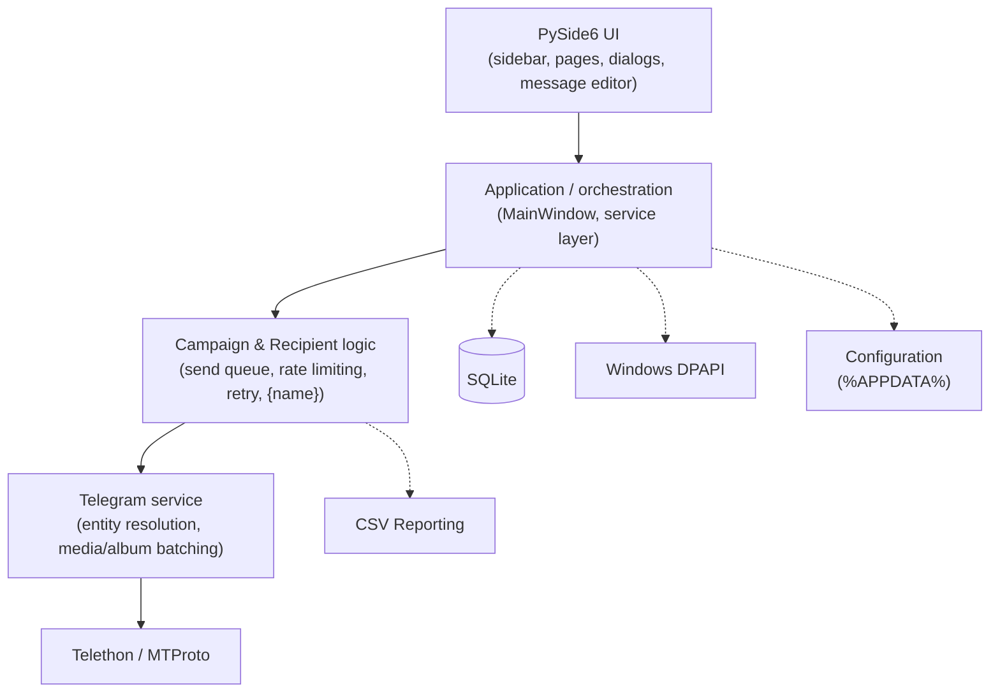

# TelegramMassSender

A Windows desktop application that sends personal Telegram messages to a list of recipients, one at a time, from your own Telegram account — built with **Python**, **PySide6**, **qasync**, and **Telethon** (MTProto).



[](https://github.com/BagroDeRose/TelegramMassSender/actions/workflows/tests.yml)
[](LICENSE)
[](https://github.com/BagroDeRose/TelegramMassSender/releases/latest)

> **AI-assisted development disclosure:** this project was built with extensive AI assistance (Claude Code), under my direction and verification — I defined the requirements, architecture, and scope; reviewed every change; required regression tests; investigated and reproduced bugs myself; and performed a security/privacy audit and manual packaged-build validation before each release. See [AI-Assisted Development](#ai-assisted-development) for details.

---

## Overview

TelegramMassSender sends the *same message, personally, to each recipient in a list* — one Telegram message per person, from the user's own account, the way you'd write to each of them individually. It is not a bot, not a bulk-marketing tool, and does not send to groups or channels. It integrates directly with Telegram's native **MTProto** protocol via **Telethon** — not the Bot API — and runs a real async event loop (**qasync**) bridging Qt's UI thread with `asyncio` network I/O.

It supports multiple Telegram accounts, rich text formatting, media/album attachments, per-recipient `{name}` personalization (including from a CSV column), phone-number recipient resolution, a Telegram-style live message preview, named message presets and recipient groups, an optional step-by-step Campaign Wizard, failed-recipient retry, structured diagnostics, a full Russian/English UI, and campaign reporting — all backed by a 564-test automated regression suite and a real Windows-packaged build (PyInstaller).

## Key Features

- Personal, one-by-one messages from your own Telegram account — no bots, no group/channel sending.
- Recipients by `@username`, numeric Telegram ID, `t.me` link, or E.164 phone number — pasted directly, imported from a TXT file, or imported from a CSV file (columns detected automatically, including an optional name column mapped to `{name}`).
- Per-recipient name personalization via a `{name}` placeholder, including inside rich-text formatting; a CSV-supplied name takes priority over Telegram's own name for that recipient.
- Rich text editor (bold/italic/underline/strikethrough/spoiler/monospace/code block/links/emoji) with a live Telegram-style message preview, including a personalization preview against an example name.
- Named message presets (text, formatting, attachments, optionally the sending interval) and named local recipient groups — save and reload a recipient list or a message template by name.
- An optional step-by-step Campaign Wizard (Recipients → Message → Attachments → Sending options → Preview → Confirmation) alongside the existing fast single-page workflow.
- Photo, video, and document attachments, with automatic album batching, image thumbnails, and drag-to-reorder.
- Multiple Telegram accounts with persistent sessions and live switching.
- Configurable randomized send interval with FloodWait-aware pausing (Telegram's own rate limits are respected, never bypassed), a pre-start duration estimate, and a live elapsed/remaining-time display while a campaign runs.
- Retry failed recipients (selected or all) after a campaign finishes, without resending anyone who already succeeded.
- Live campaign statistics, failure-reason breakdowns, a filterable per-recipient results list, an event journal, and CSV report export/saving (including an export-failures-only option).
- A Diagnostics panel (app/Python/Telethon versions, database/Telegram/network status) and a one-click sanitized diagnostic bundle export for troubleshooting.
- Full Russian/English UI with instant language switching (no restart), plus light and dark themes applied instantly across the whole UI.
- Windows DPAPI-encrypted credential storage; no secrets ever written to logs, including the structured diagnostic event log.

## Screenshots

| Campaign — Dark | Campaign — Light |
|---|---|
|  |  |

| Accounts | Settings |
|---|---|
|  |  |

| Results & Journal |
|---|
|  |

*All screenshots use synthetic demo data — no real Telegram accounts, recipients, or personal information.*

## Technology Stack

| Layer | Technology |
|---|---|
| UI | Python 3.13, PySide6 (Qt 6) |
| Async runtime | `qasync` — bridges Qt's event loop with `asyncio` so network waits (including multi-minute FloodWait pauses) never block the UI |
| Telegram integration | Telethon, speaking MTProto directly (not the Bot API) |
| Persistence | SQLite (accounts, settings, saved-report metadata, message presets, recipient groups) |
| Credential security | Windows DPAPI (`CryptProtectData`/`CryptUnprotectData`) |
| Packaging | PyInstaller (portable one-folder build) |
| Testing | pytest + pytest-asyncio, with a hand-built mock Telegram client |

## Architecture



The UI never talks to Telethon directly — it goes through the campaign/service layer, which is what makes the mocked-client test suite possible (see [Testing](#testing)).

## Engineering Highlights

A few parts of this project involved real engineering problems, not just wiring up a framework:

1. **Qt + asyncio integration (`qasync`).** Qt owns its own event loop; Telethon needs `asyncio`. Running both in the same thread — without blocking the UI during a network call or a multi-minute FloodWait — is a real event-loop integration problem, not just `async def` syntax.
2. **Telethon / MTProto integration.** Direct use of Telegram's native protocol client (not the simpler Bot API), including manual entity resolution and album/media construction.
3. **UTF-16 entity offset handling.** Telegram's rich-text formatting offsets are defined in UTF-16 code units, not Python string indices. Splicing a variable-length `{name}` into already-formatted text — correctly, across astral-plane emoji, without corrupting bold/link boundaries — required working in UTF-16 surrogate-pair space.
4. **Media/album batching under Telegram's constraints.** Photos/videos are grouped into albums of up to 10, and a message decides at the 1024-character boundary whether text becomes a caption or its own leading message — without ever silently dropping the user's text.
5. **FloodWait-aware campaign handling.** Telegram's own rate-limit signal pauses the queue, surfaces the wait time, and requires an explicit manual resume — the app never auto-retries around it.
6. **Duplicate campaign-start race protection.** A synchronous guard closes a real TOCTOU gap between a button click and an awaited network call that could otherwise let two independent send loops run over the same recipient list. Found via code review, reproduced with a failing test, then fixed.
7. **Windows DPAPI credential protection.** API credentials are encrypted at rest via the real Windows `CryptProtectData` API, tied to the OS user account — no custom cryptography, no key management burden.
8. **CSV formula-injection protection.** Exported report cells routinely start with `@` or `+` (this app's own recipient formats) — exactly the character set Excel/Sheets can interpret as a formula. Cells are neutralized with the standard mitigation.
9. **Account/session persistence and switching.** Multiple independent Telegram sessions, correctly isolated, with the active account restored across restarts and switching blocked mid-campaign.
10. **One start path, three entry points.** The fast single-page workflow, the optional step-by-step Campaign Wizard, and failed-recipient Retry all funnel into the exact same validation/start method rather than each reimplementing it — a wizard or a retry can only ever start a campaign the same way the main "Start" button already does, so a fix or a safety check applied once covers all three.
11. **Content-based CSV column detection.** CSV recipient import has no header-parsing or manual column-mapping step: each cell is tried against the same recipient-format recognizer the plain paste box already uses, so the first cell that looks like a username/ID/phone becomes that row's recipient regardless of column order, and another non-matching cell becomes that row's `{name}` value.
12. **Automated regression testing** against a hand-built mock Telegram client, including reproduce-first regression tests for the bugs above.

Ordinary parts — not oversold: the settings page is a straightforward form bound to a dataclass, SQLite access is plain parameterized `sqlite3`, and the CSV export itself is a standard `csv.writer`. None of that is architecturally novel; the value is in the items above.

## Testing

```
pytest tests/ -v
```

**564 automated tests, 0 failures** (pytest + pytest-asyncio), run against a hand-built mock Telegram client (`tests/mocks/mock_telegram_client.py`) — no real Telegram account or network access needed. Coverage includes:

- Recipient parsing and import (all supported formats including phone numbers and malformed input, TXT import, and content-based CSV column/name detection).
- Rich-text formatting and UTF-16 entity offset correctness, including the `{name}` placeholder (typed, CSV-supplied, and at message lengths well past Telegram's own text limit).
- Campaign lifecycle: start/pause/stop, FloodWait handling, retry/resume, the duplicate-start race fix, failed-recipient retry, and reconnection after a simulated network drop.
- Account persistence and switching (including the mid-campaign switch guard).
- Presets and recipient groups: save/load/rename/delete round-trips, including corrupted-data handling.
- Reporting: CSV generation, the formula-injection guard, saved-report persistence, failure-category grouping, export-failures-only.
- UI behavior (button enable/disable states, theme and language application, settings persistence, the Campaign Wizard's step navigation).
- Security-relevant behavior (DPAPI round-tripping, secret scrubbing in logs, diagnostic bundle export never containing credentials or session data).
- Reliability edge cases: unreadable/missing/corrupted attachments, very large files, application close during an active campaign.

This is distinct from **manual packaged-build validation**: before each release, the actual PyInstaller-built `.exe` is launched and walked through its core flows (account load/restore, theme switching, campaign UI, clean shutdown) on a real Windows environment. The automated suite and the manual EXE check cover different failure modes — the suite verifies logic; the manual pass verifies the packaged artifact itself (bundled assets, native rendering, no dev-only paths). Neither is presented as a coverage percentage, since none is currently measured.

## Security

- API credentials are encrypted at rest using **Windows DPAPI**, tied to the OS user account.
- The two-factor authentication password is never persisted — used once to complete login, then discarded.
- Report CSV cells are sanitized against formula injection (a leading `=`, `+`, `-`, or `@` is neutralized).
- The rotating application log has secret-scrubbing built in — API credentials are never written to it.
- No plaintext credentials anywhere on disk; Telegram session files live under `%APPDATA%`, never in the repository.

## AI-Assisted Development

This project's requirements, architecture, and scope were defined and directed by the developer (BagroDeRose). Implementation was done with extensive AI assistance — primarily **Claude Code** — used for writing code, debugging, writing tests, code review, and documentation, always under human direction and verification rather than as unsupervised generation:

- Every change is covered by the automated test suite (564 tests, pytest/pytest-asyncio, mocked Telegram client).
- Bug fixes follow a reproduce → understand root cause → write a failing test → fix → regression test cycle, not guesswork.
- A dedicated code review and security/privacy audit was performed before each public release (secret storage, log contents, session handling, git history sanitization).
- The packaged Windows `.exe` is manually launched and validated before release — a successful build is not treated as sufficient on its own.

This is not a claim that every line was hand-typed, and it is not an unsupervised AI-generated project either — it's AI used as an engineering tool, directed and checked by a human at every step.

## Download

Latest release: **[v1.3.0](https://github.com/BagroDeRose/TelegramMassSender/releases/latest)** — download `TelegramMassSender-Windows.zip`, extract, and run `TelegramMassSender.exe`. No installation required. Full setup instructions (including obtaining a Telegram API ID/Hash) are in the [Russian user documentation](#документация-на-русском-языке) below.

## Limitations

- Does not bypass or attempt to bypass Telegram's anti-spam/flood limits — it is not a policy-bypass tool.
- Telegram itself determines what sending activity is allowed for a given account; this cannot be controlled or guaranteed by the app.
- Recipient resolution by phone/username/ID can fail due to the recipient's own Telegram privacy settings, not an app defect.
- Delivery and read receipts are not guaranteed — the app only sends via the official API.
- Recipient lists must be people you have a legitimate personal reason to message — not cold/purchased contact lists, and never groups or channels.

---

## Документация на русском языке

Полное руководство пользователя (первый запуск, получение API ID/API Hash, подключение аккаунта, все функции интерфейса, устранение неполадок) — на русском языке, ниже.

### Быстрый старт

1. Распакуйте ZIP-архив.
2. Откройте папку `TelegramMassSender` и запустите `TelegramMassSender.exe`.
3. Получите **API ID** и **API Hash** на сайте `my.telegram.org` (подробно — ниже, в разделе [«Первый запуск и подключение Telegram»](#первый-запуск-и-подключение-telegram)).
4. На странице **«Аккаунты»** (боковое меню) подключите свой Telegram-аккаунт.
5. На странице **«Кампания»** добавьте получателей — вручную, из TXT-файла или номерами телефонов.
6. Напишите текст сообщения; при желании используйте `{name}`, чтобы подставить имя каждого получателя.
7. При необходимости прикрепите файл, фото или видео.
8. Настройте интервал отправки на странице **«Настройки»** (или оставьте значения по умолчанию).
9. Нажмите **«▶ Начать рассылку»** и следите за прогрессом в журнале и на странице «Результаты».

Дальше — то же самое подробно, по шагам, с примерами и объяснением всех непонятных слов.

### Содержание

- [Возможности](#возможности)
- [Первый запуск и подключение Telegram](#первый-запуск-и-подключение-telegram)
- [Если my.telegram.org не открывается (актуально для РФ)](#если-mytelegramorg-не-открывается-актуально-для-рф)
- [Что такое API ID и API Hash и где их взять](#что-такое-api-id-и-api-hash-и-где-их-взять)
- [Подключение Telegram-аккаунта в программе](#подключение-telegram-аккаунта-в-программе)
- [Несколько аккаунтов](#несколько-аккаунтов)
- [Как добавить получателей](#как-добавить-получателей)
- [Группы получателей](#группы-получателей)
- [Создание сообщения](#создание-сообщения)
- [Автоматическая подстановка имени ({name})](#автоматическая-подстановка-имени-name)
- [Шаблоны сообщений (пресеты)](#шаблоны-сообщений-пресеты)
- [Мастер кампании](#мастер-кампании)
- [Интервал отправки и запуск рассылки](#интервал-отправки-и-запуск-рассылки)
- [Журнал](#журнал)
- [Результаты рассылки, повтор ошибок и сохранённые отчёты](#результаты-рассылки-повтор-ошибок-и-сохранённые-отчёты)
- [Темы оформления и язык интерфейса](#темы-оформления-и-язык-интерфейса)
- [Настройки](#настройки)
- [Диагностика](#диагностика)
- [Если что-то не работает](#если-что-то-не-работает)
- [Ограничения](#ограничения)
- [Безопасность](#безопасность)
- [Для разработчиков](#для-разработчиков)

---

### Возможности

- Личные сообщения из вашего собственного Telegram-аккаунта, по одному, только тем получателям, которых вы указали сами.
- Получатели в любом сочетании форматов: `@username`, числовой Telegram ID, ссылка `t.me/username`, номер телефона в международном формате — вручную, из TXT-файла или из CSV-файла (колонки определяются автоматически, включая необязательную колонку с именем для `{name}`).
- Автоматическая подстановка имени получателя в текст сообщения — плейсхолдер `{name}`; имя из CSV-файла имеет приоритет над именем из самого Telegram для этого получателя.
- Форматирование текста (жирный, курсив, подчёркнутый, зачёркнутый, спойлер, моноширинный текст, блок кода, ссылки, emoji) в отдельном редакторе сообщений, с живым предпросмотром сообщения в стиле Telegram прямо на странице «Кампания», включая предпросмотр с примером имени для `{name}`.
- Именные шаблоны сообщений (текст, форматирование, вложения и, при желании, интервал отправки) и именные группы получателей — можно сохранить и позже загрузить список получателей или текст сообщения по названию.
- Необязательный пошаговый «Мастер кампании» (Получатели → Сообщение → Вложения → Параметры отправки → Предпросмотр → Подтверждение) как альтернатива обычной работе на одной странице — быстрый способ остаётся без изменений.
- Фото, видео и документы вложением, с автоматической группировкой фото/видео в альбомы, миниатюрами изображений и изменением порядка вложений перетаскиванием.
- Несколько подключённых Telegram-аккаунтов с быстрым переключением между ними.
- Настраиваемый случайный интервал между отправками, корректная и безопасная обработка временных ограничений Telegram (FloodWait) без попыток их обойти, приблизительная оценка длительности рассылки до старта и живой счётчик прошедшего/оставшегося времени во время неё.
- Повторная отправка неудачным получателям (выбранным или всем сразу) после завершения рассылки — без повторной отправки тем, кому сообщение уже доставлено.
- Живая статистика рассылки, разбивка по причинам ошибок, фильтруемый список получателей по статусу, журнал событий в реальном времени, экспорт и сохранение отчётов в CSV (включая экспорт только неудачных отправок).
- Раздел «Диагностика» (версии приложения/Python/Telethon, состояние базы данных, статус подключения к Telegram) и экспорт диагностического пакета в один клик — для обращения в поддержку.
- Полностью русский и английский интерфейс с мгновенным переключением языка без перезапуска, а также светлая и тёмная тема оформления, применяемые мгновенно.
- Все данные (Telegram-сессии, настройки, отчёты, шаблоны, группы получателей) хранятся локально на вашем компьютере; секреты — в зашифрованном виде.

---

### Первый запуск и подключение Telegram

#### Шаг 1. Скачайте и распакуйте программу

1. Скачайте файл `TelegramMassSender-Windows.zip` со страницы [Releases](https://github.com/BagroDeRose/TelegramMassSender/releases/latest) этого репозитория.
2. Нажмите на нём правой кнопкой мыши → **«Извлечь всё…»** (Extract All).
3. Выберите папку, куда распаковать — например, `C:\TelegramMassSender\`.
4. Откройте получившуюся папку `TelegramMassSender`.

#### Шаг 2. Запустите программу

Дважды кликните на файл **`TelegramMassSender.exe`**.

> **Важно:** никакой дополнительной установки не требуется. Не нужно ставить Python, Node.js или что-либо ещё — в папке уже есть всё необходимое для работы программы. Если Windows Defender SmartScreen покажет предупреждение «Windows защитила ваш компьютер» (это стандартная реакция на новые exe-файлы без цифровой подписи) — нажмите **«Подробнее»**, затем **«Выполнить в любом случае»**.

#### Шаг 3. Получите доступ к Telegram-аккаунту через официальный API

Чтобы программа могла заходить в Telegram от имени вашего аккаунта (а не через стороннего бота), Telegram требует два значения, которые выдаются лично вам на официальном сайте разработчиков Telegram:

- **API ID** — короткий номер (например, `12345678`);
- **API Hash** — длинная строка из букв и цифр (например, `a1b2c3d4e5f6a7b8c9d0e1f2a3b4c5d6`).

Это не пароль и не код от Telegram — это просто «пропуск», которым программа представляется серверам Telegram. Получить его можно бесплатно и за пару минут — см. следующий раздел.

---

### Если my.telegram.org не открывается (актуально для РФ)

Сайт, на котором выдаются API ID и API Hash — `my.telegram.org` — у части пользователей из России может не открываться напрямую (сайт долго грузится или вообще не отвечает). Это не поломка программы — это проблема с доступом к самому сайту Telegram.

#### Что такое файл `hosts` и зачем он нужен

Когда вы вводите в браузере адрес сайта (например, `my.telegram.org`), компьютер сначала должен узнать, по какому IP-адресу этот сайт находится — этим обычно занимаются серверы DNS в интернете. Файл `hosts` — это системный файл Windows, в котором можно вручную «прописать», по какому IP-адресу открывать конкретный сайт, — компьютер в первую очередь смотрит именно в этот файл, и только потом обращается к DNS в интернете. Если у вас доступ к DNS-адресу сайта заблокирован или работает нестабильно, ручное указание IP-адреса в `hosts` часто помогает открыть сайт напрямую.

> На момент подготовки этой инструкции указанный ниже IP-адрес был проверен и точно рабочий (сайт открылся, страница загрузилась). **Но IP-адреса серверов Telegram могут со временем меняться** — это не постоянная гарантия на будущее. Если через какое-то время адрес перестанет работать, эту инструкцию нужно будет повторить с актуальным IP-адресом.

#### Пошаговая инструкция (Windows 10/11)

> Если у вас **и так всё открывается** — сайт `my.telegram.org` нормально загружается в браузере без этой правки — просто пропустите весь этот раздел, ничего добавлять не нужно.

**1.** Закройте браузер полностью (все окна).

**2.** Откройте **Блокнот от имени администратора**:
- нажмите на кнопку «Пуск», начните печатать `Блокнот`;
- на найденном приложении «Блокнот» нажмите правой кнопкой мыши → **«Запуск от имени администратора»**;
- подтвердите запрос Windows (кнопка «Да»).

**3.** В Блокноте нажмите **Файл → Открыть** и введите в поле «Имя файла» точный путь:

```
C:\Windows\System32\drivers\etc\hosts
```

**4.** Если файл не отображается в списке — в выпадающем списке типов файлов справа внизу выберите **«Все файлы (*.*)»**, тогда файл `hosts` появится.

**5.** В самый конец файла (после всех существующих строк, с новой строки) добавьте:

```
149.154.167.220 my.telegram.org
```

**6.** Сохраните файл: **Файл → Сохранить** (Ctrl+S). Если Windows выдаёт ошибку сохранения — значит, Блокнот был открыт не от имени администратора; повторите шаг 2.

**7.** Откройте **командную строку от имени администратора**:
- «Пуск» → начните печатать `cmd`;
- на найденном приложении «Командная строка» нажмите правой кнопкой мыши → **«Запуск от имени администратора»**.

**8.** Выполните команду, чтобы компьютер забыл старые (возможно, неправильные) адреса сайтов, которые он запомнил ранее:

```
ipconfig /flushdns
```

Должно появиться сообщение вроде «Кэш сопоставителя DNS успешно очищен».

**9.** Проверьте, что сайт теперь виден компьютеру, командой:

```
ping my.telegram.org
```

**Нормальный результат** — несколько строк вида `Ответ от 149.154.167.220: число байт=32 время<1мс`. Если вместо этого написано «Превышен интервал ожидания» или «Узел недоступен» на всех строках — значит, соединение всё ещё не проходит (возможно, дело не только в DNS, а в блокировке самого IP-адреса; попробуйте включить VPN и повторить получение API ID/API Hash через него).

**10.** Откройте браузер и перейдите на:

```
https://my.telegram.org/apps
```

Сайт должен открыться и предложить вход по номеру телефона — переходите к следующему разделу.

#### Как вернуть всё обратно (необязательно)

Правка `hosts` нужна только для того, чтобы один раз получить API ID и API Hash. После этого её можно спокойно убрать — на работу уже установленной программы TelegramMassSender это никак не влияет (программа обращается напрямую к серверам Telegram, а не к сайту `my.telegram.org`).

1. Откройте `C:\Windows\System32\drivers\etc\hosts` в Блокноте от имени администратора (как в шагах 2–3 выше).
2. Удалите добавленную строку `149.154.167.220 my.telegram.org`.
3. Сохраните файл.
4. Снова выполните в командной строке от имени администратора: `ipconfig /flushdns`.

---

### Что такое API ID и API Hash и где их взять

**1.** Откройте в браузере: **https://my.telegram.org/apps**

**2.** Войдите по своему номеру телефона Telegram (сайт запросит код подтверждения — он придёт в приложение Telegram на телефон, как обычный код входа).

**3.** Откроется страница **«API development tools»**. Заполните короткую форму создания приложения:

| Поле | Что указать |
|---|---|
| **App title** | Любое понятное вам название, например `MyDesktopApp` |
| **Short name** | Короткое имя без пробелов, например `mydesktop` |
| **URL** | Если поле обязательно — укажите `https://example.com` |
| **Platform** | Выберите **Desktop** |
| **Description** | Короткое описание, например «личное приложение для отправки сообщений» |

Нажмите **Create application**.

**4.** На открывшейся странице появятся два значения:
- **App api_id** — это и есть ваш **API ID**;
- **App api_hash** — это ваш **API Hash**.

#### Важно про эти данные

> - **API Hash — это секрет.** Его нельзя публиковать, пересылать в чатах, выкладывать на GitHub, показывать в скриншотах и т.д. — как и любой пароль.
> - Это **не пароль от вашего Telegram-аккаунта** — это отдельный идентификатор именно приложения. Сам по себе он не даёт доступа без дальнейшей авторизации по номеру телефона и коду.
> - **Не используйте чужие** API ID/API Hash, найденные где-то в интернете или полученные от посторонних людей — используйте только свои собственные, полученные описанным выше способом на вашем аккаунте.
> - Эти два значения нужно один раз ввести в программу TelegramMassSender при подключении аккаунта (см. ниже) — больше они нигде не понадобятся.

---

### Подключение Telegram-аккаунта в программе

**1.** Запустите `TelegramMassSender.exe`.

**2.** В боковом меню слева выберите раздел **«Аккаунты»** и нажмите кнопку **«+ Добавить аккаунт»**.

**3.** Откроется окно **«Подключение Telegram»**. Заполните поля:
- **API ID:** — число, полученное на `my.telegram.org` (см. выше);
- **API Hash:** — строка, полученная там же;
- **Телефон:** — номер вашего Telegram-аккаунта в международном формате, например `+79991234567` (обязательно со знаком `+` и кодом страны).

Нажмите **«Подключить»**.

**4.** В Telegram (на телефоне или в другом уже открытом Telegram) придёт код подтверждения. Введите его в поле **«Введите код из Telegram»** и нажмите **«Подтвердить»**.

**5.** Если на вашем аккаунте включена **двухфакторная аутентификация** (дополнительный пароль при входе) — появится ещё один экран: **«Введите пароль двухфакторной аутентификации»**. Введите этот пароль и нажмите **«Подтвердить»**.

> Этот пароль **нигде не сохраняется** — он используется один раз, только чтобы завершить вход, и сразу забывается программой.

**6.** После успешного входа появится экран **«✓ Telegram аккаунт подключён»** с номером телефона, именем и username аккаунта. Нажмите **«Готово»**.

Аккаунт появится отдельной карточкой на странице «Аккаунты», а внизу окна, в строке состояния, будет видно, какой аккаунт сейчас активен — программа готова к работе.

---

### Несколько аккаунтов

Программа умеет работать с несколькими вашими личными Telegram-аккаунтами. Все они видны на странице **«Аккаунты»** — каждый в виде отдельной карточки с именем/телефоном, username и статусом подключения.

- **Добавить второй (и следующий) аккаунт** — снова нажмите **«+ Добавить аккаунт»** и повторите шаги входа (API ID и API Hash уже будут подставлены автоматически — нужно только заново ввести номер телефона, код и, если нужно, пароль 2FA).
- **Статус аккаунта** обозначен текстом и цветной точкой на карточке: «Подключён» (зелёная) — аккаунт готов к работе; «Проблема с подключением» (жёлтая) — временные неполадки сети, помогает кнопка «Переподключить»; «Требуется повторная авторизация» (красная) — сессия недействительна, нужно подключить аккаунт заново; «Не авторизован» — статус ещё не проверялся.
- **Переключение между аккаунтами** — кнопка «Использовать» на карточке нужного аккаунта; активный аккаунт помечен рамкой и подсветкой, а его кнопка показывает «Активен».
- **Аккаунты никогда не смешиваются.** У каждого аккаунта — своя отдельная, независимая Telegram-сессия; переключение между ними не затрагивает данные других аккаунтов.
- **Ранее выбранный аккаунт запоминается** — при следующем запуске программы автоматически становится активным тот же аккаунт, что был активен при выходе (если он всё ещё подключён).
- **Пока идёт рассылка**, переключить аккаунт, добавить новый или удалить любой из них нельзя — соответствующие кнопки становятся неактивны до окончания или остановки рассылки.
- **Удаление аккаунта** — кнопка удаления (×) на карточке аккаунта. Программа переспросит: *«Удалить аккаунт? Будет удалена локальная Telegram-сессия аккаунта … Продолжить?»* — нужно подтвердить кнопкой **«Да»**. После этого для повторного использования этого аккаунта нужно будет подключить его заново (ввести код из Telegram ещё раз).

---

### Как добавить получателей

Получатели указываются в текстовом поле карточки **«Получатели»** на странице «Кампания» — **по одному на строку**. Поддерживаются такие варианты записи:

```
@username
123456789
https://t.me/username
t.me/username
+4917612345678
```

Пример списка получателей:

```
@user1
@user2
123456789
https://t.me/user3
+4917612345678
```

- **`@username`** — Telegram username получателя.
- **Числовой ID** — просто цифры, Telegram ID пользователя.
- **Ссылка на профиль** — `https://t.me/username`, `http://t.me/username` или `t.me/username`.
- **Номер телефона** — строго в международном формате E.164: начинается со знака `+`, затем код страны и номер (всего 8–15 цифр, первая — не ноль), например `+4917612345678`. Номер **без** `+` (местный формат) программа не принимает — она не пытается угадать код страны, чтобы случайно не написать не тому человеку.

Программа автоматически:
- убирает пустые строки;
- удаляет повторяющихся получателей (дубликаты);
- отмечает строки, которые не подходят ни под один из поддерживаемых форматов (счётчик «ошибок формата» под полем).

Под полем ввода в реальном времени видно: сколько получателей распознано как валидные, сколько с ошибками формата и сколько дубликатов было убрано.

> **Важно:** программа предназначена **только для личной переписки** — по одному сообщению каждому получателю лично. Она не должна использоваться для отправки сообщений в группы, каналы или чужие беседы, и списки для рассылки должны состоять из ваших личных контактов, готовых получить от вас сообщение.

#### Если получатель не находится

Даже при корректном формате строки Telegram может не дать программе найти или написать конкретному человеку — это ограничение самого Telegram, а не ошибка программы:

- **Username не находится** — вероятно, опечатка, пользователь сменил username, либо аккаунта с таким именем не существует.
- **Числовой ID не срабатывает** — чтобы найти пользователя по одному только числовому ID, серверу Telegram иногда нужно, чтобы этот пользователь уже был так или иначе «виден» вашему аккаунту (например, есть в контактах или в общем чате). Попробуйте вместо ID указать `@username` или ссылку на профиль.
- **Номер телефона не резолвится** — программа ищет пользователя по номеру напрямую, не добавляя его в контакты. Если Telegram не смог найти пользователя по номеру, программа покажет: *«Telegram не смог разрешить этот номер телефона. Пользователь может быть недоступен по номеру из-за настроек приватности Telegram.»* — это значит, что сам получатель в настройках приватности Telegram скрыл возможность находить себя по номеру телефона; программа не может и не пытается обойти это ограничение.

#### Импорт получателей из TXT-файла

Если получателей много, удобнее подготовить обычный текстовый файл:

1. Создайте обычный текстовый файл (например, через Блокнот) со списком получателей — **по одному на строку**, в тех же форматах, что и выше.
2. Сохраните файл с расширением **`.txt`** (например, `recipients.txt`).
3. В программе нажмите кнопку **«Импорт TXT»**.
4. Выберите ваш файл.

После импорта появится сводка: сколько строк импортировано, сколько дубликатов убрано, сколько строк оказались некорректными и сколько итоговых получателей добавлено в список.

#### Импорт получателей из CSV-файла

Кнопка **«Импорт CSV»** рядом с «Импорт TXT» открывает файл в формате CSV (с разделителем `,` или `;` — определяется автоматически). Колонки не нужно размечать вручную:

- В каждой строке программа сама находит колонку с получателем — ту, где значение выглядит как `@username`, числовой ID, ссылка `t.me/...` или номер телефона в международном формате (`+...`). Не важно, в каком по счёту столбце она находится.
- Если в той же строке есть ещё одна непустая колонка, не похожая на получателя (например, колонка с именем), её значение подставляется как имя этого получателя для `{name}` — оно используется вместо имени из самого Telegram специально для этой рассылки.
- Строка без узнаваемого получателя ни в одной колонке считается некорректной — её можно посмотреть кнопкой «Показать ошибки» (см. ниже).

Например, CSV-файл с такими строками:

```
Иван Петров,@ivan_petrov
Мария Смирнова,+491761234567
```

даст двух получателей — `@ivan_petrov` с именем «Иван Петров» для `{name}`, и `+491761234567` с именем «Мария Смирнова».

#### Просмотр некорректных строк

Если после ручного ввода, вставки текста или импорта в списке получателей есть строки, не подходящие ни под один формат, под полем ввода появляется ссылка **«Показать ошибки»** — она открывает список этих строк с указанием причины по каждой (например, «Некорректный username» или «В строке не найден @username, ID или номер телефона»). Эта кнопка доступна в любой момент, не только сразу после импорта.

Кнопка **«Очистить»** полностью очищает поле получателей.

---

### Группы получателей

Если один и тот же список получателей используется регулярно (например, «Клиенты» или «Тестовые аккаунты»), его можно сохранить под названием и не вводить заново каждый раз. Строка с группами расположена прямо под полем ввода получателей, на странице «Кампания»:

- **«Сохранить как…»** — сохраняет текущий список получателей (включая имена для `{name}`, если они пришли из CSV-импорта) под именем, которое вы укажете.
- **«Загрузить»** — заменяет текущий список получателей на содержимое выбранной в выпадающем списке группы.
- **«Удалить»** — удаляет выбранную группу (программа переспросит подтверждение).

Группа — это только список получателей и, при наличии, их имена для `{name}`; никакой дополнительной информации (заметок, истории переписки, тегов) программа не хранит — это не CRM-система, а просто именованный, сохранённый список.

---

### Создание сообщения

В карточке **«Сообщение»** на странице «Кампания» показан только краткий предпросмотр текста — само редактирование происходит в отдельном окне, чтобы длинные сообщения (на несколько тысяч символов) было удобно писать и просматривать целиком.

1. Нажмите **«✏ Открыть редактор»**.
2. Откроется отдельное окно **«Редактор сообщения»** — его можно свободно менять по размеру (потянуть за край или угол окна), в нём есть прокрутка для длинного текста.
3. Введите текст и, при необходимости, выделите фрагмент и примените форматирование через панель кнопок сверху:

| Кнопка | Что делает |
|---|---|
| **B** | Жирный текст |
| **I** | Курсив |
| **U** | Подчёркнутый текст |
| **S** | Зачёркнутый текст |
| **🙈** | Спойлер (в Telegram скрыт «под шторкой», пока получатель не нажмёт на него) |
| **`<>`** | Моноширинный текст «как код» |
| **`{ }`** | Блок кода (для более крупных фрагментов) |
| **🔗** | Добавить ссылку к выделенному тексту (программа спросит адрес ссылки) |
| **🙂** | Вставить emoji из готового набора |

Нажатая кнопка подсвечивается, пока курсор находится внутри соответствующего форматирования — так видно, какой стиль сейчас активен. Внизу окна редактора отображается счётчик символов.

4. Нажмите **«Применить»**, чтобы перенести текст обратно в главное окно, либо **«Отмена»** (или крестик), чтобы закрыть редактор без сохранения — если есть несохранённые изменения, программа переспросит.

Всё форматирование, применённое в редакторе, корректно передаётся в Telegram — получатель увидит именно то форматирование, которое вы выбрали. В главном окне под текстом виден живой предпросмотр в стиле Telegram (не точная копия внешнего вида приложения, но реальный рендер применённого форматирования, а не примерная заглушка) — он обновляется сразу при любом изменении текста или вложений.

Если в тексте использован плейсхолдер `{name}` (см. следующий раздел), рядом с предпросмотром есть поле **«Пример имени для {name}:»** — по умолчанию туда подставлено «Александр»/«Alex», но поле можно изменить на любое имя, чтобы увидеть, как сообщение будет выглядеть с разными именами. Это именно *пример* — реальное имя конкретного получателя программе заранее не известно, оно становится известно только в момент отправки, когда Telegram возвращает данные о найденном пользователе.

> В текущей версии нет отдельной кнопки «Тестовая отправка». Чтобы заранее проверить, как сообщение и вложения будут выглядеть на практике, добавьте в список получателей свой второй Telegram-аккаунт (или доверенного знакомого) первым — и запустите обычную рассылку на этот единственный адрес, прежде чем вставлять в список всех остальных получателей.

#### Добавление файлов, фото и видео

Под текстовым полем — карточка **«Вложения»**:

- нажмите **«Добавить файл»** и выберите один или несколько файлов, **или**
- просто перетащите файлы мышью в это поле.

Поддерживаются фотографии (JPG, PNG, WEBP), видео (MP4, MOV, AVI), а также любые документы: PDF, Word (DOC/DOCX), Excel (XLS/XLSX), PowerPoint (PPT/PPTX), TXT, ZIP-архивы и практически любые другие обычные файлы.

Каждое добавленное изображение показывается в списке вложений маленькой миниатюрой (с сохранением пропорций) — видно, что именно прикреплено, до отправки. Файлы, для которых миниатюру показать нельзя (видео, документы), отображаются обычной иконкой файла с именем и размером.

Если добавлено сразу несколько фото/видео подряд — Telegram сгруппирует их в единый альбом (до 10 файлов в одном альбоме; если файлов больше, программа сама разобьёт их на несколько альбомов). Обычные документы всегда отправляются отдельными сообщениями. Кнопки **«Удалить выбранное»** и **«Очистить»** убирают выбранные или сразу все вложения из списка.

**Пример подготовки сообщения:** в поле сообщения написан текст «Добрый день! Высылаю презентацию, ознакомьтесь, пожалуйста.», в карточке «Вложения» добавлен файл `presentation.pptx` — при отправке получатель увидит текст и файл вместе (если текст короткий) либо текст отдельным сообщением, а сразу за ним — файл (если текст слишком длинный для подписи к файлу — программа сама разделит их на два сообщения, но текст никогда не потеряется).

---

### Автоматическая подстановка имени ({name})

Текст сообщения может содержать плейсхолдер **`{name}`** — прямо в поле ввода, в любом месте текста, в том числе внутри форматированного (жирного, курсивного и т.д.) фрагмента. Подсказка об этом видна прямо в карточке «Сообщение»: *«{name} — имя получателя в Telegram, подставляется при отправке»*.

Как это работает:

- Перед отправкой каждому конкретному получателю программа подставляет вместо `{name}` его имя (first name) из Telegram — то, которое реально видно вашему аккаунту после того, как получатель найден.
- Подстановка происходит для каждого получателя отдельно, непосредственно перед отправкой ему сообщения — один и тот же исходный текст с `{name}` используется для всех, но каждый получает версию со своим именем.
- Форматирование вокруг `{name}` (жирный, ссылка и т.п.) остаётся корректным независимо от того, короче или длиннее оказалось реальное имя, чем сам плейсхолдер.
- Если у получателя не удалось определить имя (редкий случай), `{name}` заменяется на пустую строку — сообщение не потеряется, но может выглядеть чуть иначе (например, «Здравствуйте, !» вместо «Здравствуйте, Иван!»). Учитывайте это при формулировке текста — например, добавляйте `{name}` не в самое начало фразы, а так, чтобы предложение оставалось осмысленным и без него.
- Если этот получатель был импортирован из CSV-файла с именем в отдельной колонке (см. раздел [«Импорт получателей из CSV-файла»](#как-добавить-получателей) выше), для `{name}` используется именно это, вручную указанное имя — а не имя из самого Telegram.

---

### Шаблоны сообщений (пресеты)

Готовый текст сообщения (со всем форматированием и списком вложений, а при желании — и с интервалом отправки) можно сохранить под названием и использовать повторно в другой рассылке. Строка с шаблонами расположена под полем «Пример имени для {name}», на странице «Кампания»:

- **«Сохранить как…»** — сохраняет текущий текст сообщения, форматирование, вложения и текущий интервал отправки под именем, которое вы укажете.
- **«Загрузить»** — заменяет текущее сообщение и вложения на содержимое выбранного шаблона. Если какой-то из сохранённых файлов вложений с тех пор был перемещён или удалён, программа предупредит об этом отдельно и загрузит всё остальное.
- **«Удалить»** — удаляет выбранный шаблон (программа переспросит подтверждение).

Шаблон создаётся только явным нажатием «Сохранить как…» — программа никогда не сохраняет шаблоны автоматически и не превращает историю переписки в список шаблонов.

---

### Мастер кампании

Кроме обычной работы на одной странице «Кампания», есть необязательный пошаговый режим — кнопка **«Мастер кампании»** в правом верхнем углу страницы «Кампания». Он проводит через те же самые действия по шагам, один за другим: **Получатели → Сообщение → Вложения → Параметры отправки → Предпросмотр → Подтверждение**, используя ровно те же поля ввода, редактор сообщения и список вложений, что и обычная страница — просто в виде последовательности отдельных экранов вместо одной длинной страницы.

На последнем шаге («Подтверждение») показана сводка (число получателей, число вложений, интервал отправки) и кнопка **«Начать рассылку»** — она запускает ту же самую рассылку, что и обычная кнопка «▶ Начать рассылку» на странице «Кампания» (та же самая проверка получателей/вложений, тот же диалог подтверждения, если он включён в настройках). После нажатия мастер закрывается, и дальнейший прогресс рассылки виден на обычной странице «Кампания» и в «Результатах» — отдельного экрана хода выполнения внутри мастера нет.

Мастер — это просто другой способ ввода тех же данных; обычный, быстрый способ работы (единая страница «Кампания») никуда не делся и продолжает работать как прежде.

---

### Интервал отправки и запуск рассылки

#### Что такое интервал отправки

Это пауза между отправкой сообщений разным получателям — программа не шлёт все сообщения одно за другим мгновенно, а ждёт какое-то время между каждым.

Интервал настраивается на странице **«Настройки»** → карточка **«Отправка»** (см. раздел [«Настройки»](#настройки) ниже). На странице «Кампания», в карточке «Рассылка», всегда виден текущий интервал и кнопка **«Изменить в настройках»**, которая сразу открывает нужную страницу.

- **Минимум** и **максимум** — программа сама выбирает случайное число секунд из этого диапазона перед каждой следующей отправкой.
- **По умолчанию: минимум 30 секунд, максимум 60 секунд.**
- Минимально допустимое значение — **5 секунд**, максимально допустимое — **3600 секунд** (1 час): программа не позволит поставить интервал вне этих границ.

> **Важно:** интервал между отправками снижает интенсивность работы программы и делает её поведение более похожим на обычную переписку человека, но **не является гарантией** отсутствия каких-либо ограничений со стороны Telegram. Telegram сам определяет допустимую активность аккаунта, и на это может влиять множество факторов, не связанных с настройками этой программы.

#### Управление рассылкой

- Ещё до старта, под интервалом отправки, показана приблизительная оценка длительности всей рассылки — рассчитанная по числу получателей и настроенному интервалу; она обновляется сама при изменении списка получателей или интервала.
- **▶ Начать рассылку** — запускает отправку всем подходящим получателям из списка по порядку.
- **⏸ Пауза** — приостанавливает рассылку. Текущая отправка (если она уже началась) корректно завершается, а следующая не начинается, пока не нажать «▶ Продолжить». Прогресс при этом не сбрасывается.
- **■ Остановить** — полностью останавливает рассылку.
- Во время рассылки в карточке «Рассылка» видно: сколько всего получателей, сколько отправлено, сколько ошибок, сколько пропущено, сколько ещё осталось, полоса прогресса, **какому получателю сообщение отправляется прямо сейчас** (например, «Получатель 5 из 20: @user»), а также **сколько времени уже прошло и сколько примерно осталось** — эта оценка уточняется по ходу рассылки на основе реальной скорости отправки.
- Построчный ход рассылки по каждому получателю виден в **журнале** (см. следующий раздел), а сводная статистика — на странице **«Результаты»**.
- Если включена настройка «Подтверждать запуск рассылки» (страница «Настройки»), перед стартом программа переспросит, скольким получателям будет отправлено сообщение.

#### Если Telegram временно ограничивает отправку (FloodWait)

Иногда Telegram сам временно ограничивает частоту действий аккаунта — это стандартный защитный механизм самого Telegram, а не ошибка программы. В этом случае:

- рассылка автоматически приостанавливается;
- в статусе показывается, сколько именно времени нужно подождать (это время сообщает сам Telegram);
- программа **не пытается обойти это ограничение** никаким образом — ни повторными попытками, ни сменой аккаунта, ни как-либо ещё;
- после указанного времени ожидания рассылку нужно **вручную** возобновить кнопкой «▶ Продолжить» — само по себе через 5–10 минут ничего не запустится, это осознанное решение оставлено за вами.

Отдельно от FloodWait — обычные временные сетевые сбои (например, кратковременная потеря соединения) программа обрабатывает сама: повторяет попытку отправки конкретному получателю несколько раз с увеличивающейся паузой между попытками, и только после исчерпания попыток помечает получателя как «ошибка». Это не связано с ограничениями Telegram и не настраивается через интерфейс в текущей версии.

---

### Журнал

Журнал — сворачиваемая панель сбоку окна (между боковым меню и содержимым страницы), в которой построчно, с отметкой времени, появляется результат по каждому получателю во время рассылки: `✓ @user1 — отправлено`, `✗ @user3 — пользователь не найден`, а также технические отметки о повторных попытках и паузах.

- **Показать/скрыть** — кнопка «Журнал» в строке состояния внизу окна, либо кнопка закрытия (×) в самой панели.
- Видимость журнала (открыт/закрыт) **запоминается между запусками программы**.
- Журнал очищается в начале каждой новой рассылки и хранит не более последних 300 строк одновременно.
- Это оперативный журнал текущего сеанса работы программы — он **не сохраняется на диск** и пропадает при закрытии программы. Отдельно от него на диск, в файл, пишется технический лог для диагностики (без секретов) — см. раздел [«Безопасность»](#безопасность).

---

### Результаты рассылки, повтор ошибок и сохранённые отчёты

#### Результаты текущей рассылки

На странице **«Результаты»** видна статистика по карточкам: **«Всего»**, **«Успешно»**, **«Ошибок»**, **«Пропущено»** — они обновляются в реальном времени по ходу рассылки. Там же показана итоговая длительность завершившейся рассылки, а если были ошибки — краткая разбивка по причинам (например, «Пользователь не найден: 2; Заблокирован: 1»). Данные остаются на странице и после завершения или остановки рассылки — до тех пор, пока не будет запущена новая.

Кнопка **«Экспорт CSV-отчёта»** сохраняет результаты текущей рассылки в CSV-файл по выбранному вами пути; кнопка **«Экспортировать только ошибки»** делает то же самое, но только для получателей со статусом «ошибка» — обе кнопки создают разовый файл, не связанный с библиотекой сохранённых отчётов ниже.

#### Список получателей и повторная отправка

Ниже статистики — список получателей с фильтром **«Показать: Все / Отправлено / Ошибки / Пропущено»** (по умолчанию показаны «Ошибки»). Для каждого получателя со статусом «ошибка» видна причина; напротив таких строк есть флажок для выбора.

- **«Повторить выбранные»** — запускает новую, отдельную рассылку только по отмеченным флажком получателям.
- **«Повторить все ошибки»** — то же самое, но сразу по всем получателям со статусом «ошибка», независимо от выбранного сейчас фильтра.

Повторная отправка использует ровно тот же текст сообщения, форматирование, вложения и аккаунт, что и в исходной рассылке — те, что были на момент её запуска, а не то, что сейчас случайно находится в полях на странице «Кампания». Интервал отправки при этом берётся заново из текущих настроек. Получателям, которым сообщение уже было успешно доставлено, при повторной отправке сообщение заново не отправляется — они просто не участвуют в повторной рассылке.

#### Сохранённые отчёты

Кнопка **«Сохранить отчёт»** (появляется, как только по кампании есть хотя бы один результат) добавляет текущие результаты в постоянную библиотеку отчётов: программа спросит название (по умолчанию — «Рассылка ГГГГ-ММ-ДД ЧЧ:ММ»), запишет CSV-файл в папку отчётов (настраивается в Настройки → Отчёты) и добавит карточку в список **«Сохранённые отчёты»** на той же странице.

Каждая карточка сохранённого отчёта показывает название, количество получателей/успешных отправок/ошибок и дату создания, и предлагает действия:

- **★** — добавить или убрать отчёт из избранного;
- **«Открыть»** — открыть CSV-файл в приложении по умолчанию для CSV в Windows;
- **«Экспорт»** — сохранить копию CSV в выбранное вами место;
- **«⋯»** → **«Переименовать»** / **«Удалить»**.

Список сохранённых отчётов и их метаданные (название, дата, счётчики, отметка «избранное») хранятся в локальной базе данных программы; сами CSV-файлы — в папке отчётов на диске. Удаление отчёта убирает и запись из списка, и файл. Если файл отчёта был перемещён или удалён вручную (в проводнике Windows) — «Открыть»/«Экспорт» покажут понятную ошибку, а не сбой программы.

Можно включить автоматическое сохранение отчёта после каждой рассылки — переключатель **«Автоматически сохранять отчёт после рассылки»** в Настройки → Отчёты.

#### Формат CSV

Файл сохраняется в кодировке UTF-8 с BOM (корректно открывается в Excel без «кракозябр»), разделитель столбцов — `;`. Столбцы: **Получатель**, **Тип** (username / Telegram ID / телефон), **Resolved ID** и **Resolved username** (реальные Telegram ID и username получателя — заполняются, если программа смогла его найти), **Статус**, **Ошибка** (если была), **Попыток**, **Шагов доставлено**, **Время**.

---

### Темы оформления и язык интерфейса

Программа поддерживает светлую и тёмную тему оформления, а также русский и английский язык интерфейса — оба переключаются на странице **«Настройки»** → карточка **«Внешний вид»**.

- **Тема оформления** — выпадающий список «Тема оформления» («Тёмная» / «Светлая»). Применяется мгновенно ко всему интерфейсу, включая боковое меню, журнал и карточки аккаунтов.
- **Язык интерфейса** — выпадающий список «Язык интерфейса» («Русский» / «English»). Тоже применяется мгновенно, без перезапуска программы — меняется весь текст интерфейса: меню, кнопки, сообщения, подсказки.
- Оба выбора **сохраняются и восстанавливаются** при следующем запуске программы. По умолчанию — тёмная тема и русский язык.

---

### Настройки

Страница **«Настройки»** (боковое меню) собирает все параметры программы в карточки:

- **Внешний вид** — тема оформления и язык интерфейса (см. выше).
- **Отправка** — интервал отправки (минимум/максимум в секундах, 5–3600) и переключатель «Подтверждать запуск рассылки» (показывать диалог подтверждения перед стартом каждой рассылки; по умолчанию выключен).
- **Приложение** — «Запоминать размер окна» и «Открывать последний раздел при запуске» (программа откроется на той же странице, где вы её закрыли).
- **Отчёты** — папка, в которую сохраняются CSV-отчёты (кнопки «Обзор…» и «По умолчанию»), и переключатель «Автоматически сохранять отчёт после рассылки».
- **Дополнительно** — «Расширенное логирование» (более подробный технический лог для диагностики проблем) и кнопка **«Сбросить настройки приложения»** — возвращает все перечисленные выше настройки к значениям по умолчанию (кроме выбранной темы оформления и языка) после подтверждения в диалоге.
- **Диагностика** — см. следующий раздел.

Все изменения в настройках сохраняются сразу и применяются немедленно — отдельной кнопки «Сохранить» на этой странице нет.

---

### Диагностика

Карточка **«Диагностика»** на странице «Настройки» показывает техническую информацию о текущем состоянии программы — полезно, если нужно обратиться за помощью или сообщить о проблеме:

- версия приложения, версия Python, версия библиотеки Telethon;
- состояние базы данных программы (реальная проверка, а не предположение);
- статус подключения к Telegram (подключён ли сейчас какой-либо аккаунт);
- сколько аккаунтов имеют файл сессии на диске;
- состояние сетевого соединения активного аккаунта.

Кнопка **«Копировать диагностику»** копирует весь этот текст в буфер обмена, чтобы вставить его, например, в сообщение при обращении за помощью. Кнопка **«Обновить»** пересчитывает все показатели заново. Кнопка **«Экспорт диагностического пакета»** сохраняет ZIP-архив с этой же информацией, настройками программы (без паролей и секретов) и техническим логом — удобно приложить целиком к обращению в поддержку.

> Диагностическая информация никогда не содержит API Hash, пароль двухфакторной аутентификации, содержимое файлов сессий или текст ваших сообщений — ни на экране, ни в скопированном тексте, ни в экспортированном ZIP-архиве.

---

### Если что-то не работает

#### «Не могу получить API ID/API Hash» / сайт my.telegram.org не открывается

1. Проверьте, открывается ли `https://my.telegram.org` в браузере в принципе.
2. Если не открывается — пройдите инструкцию из раздела [«Если my.telegram.org не открывается»](#если-mytelegramorg-не-открывается-актуально-для-рф) выше (правка файла `hosts` и `ipconfig /flushdns`).
3. Если и после этого не открывается — попробуйте включить VPN и повторить попытку.
4. Убедитесь, что вы входите под своим собственным номером телефона и используете свои собственные, лично полученные API ID/API Hash — не чужие.

#### Ошибка при создании приложения на my.telegram.org

Если страница `my.telegram.org/apps` открывается, но при попытке создать приложение или войти появляется ошибка соединения — чаще всего причина та же, что и выше: нестабильный доступ к сайту. Пройдите ту же инструкцию с файлом `hosts`, указанную в разделе выше, и повторите попытку.

#### Ошибка «401» при входе на my.telegram.org

Это означает, что ваша веб-сессия на сайте `my.telegram.org` устарела или не была подтверждена до конца. Решение — обновить страницу и войти заново по номеру телефона и коду подтверждения.

#### «Telegram временно ограничил отправку» (FloodWait)

Это не ошибка программы — Telegram сам временно ограничил частоту действий вашего аккаунта. Программа покажет, сколько именно нужно подождать. **Обходить это ограничение не нужно и не следует** — просто дождитесь указанного времени и нажмите «▶ Продолжить».

#### «Пользователь не найден» / username не найден

Перепроверьте правильность написания `@username` — вероятно, в имени опечатка, либо пользователь сменил username, либо аккаунта с таким именем не существует.

#### Числовой ID получателя не срабатывает

У Telegram есть техническое ограничение: чтобы найти пользователя по одному только числовому ID, серверу Telegram иногда нужно, чтобы этот пользователь уже был так или иначе «виден» вашему аккаунту (например, есть в контактах, состоит с вами в общем чате, либо у него открыт публичный username). Если голый числовой ID не срабатывает — попробуйте вместо него указать `@username` этого человека или ссылку `https://t.me/username`, если она известна.

#### Номер телефона получателя не находится

Программа ищет пользователя Telegram по номеру телефона напрямую (без добавления его в контакты). Если получатель не находится, вы увидите сообщение: *«Telegram не смог разрешить этот номер телефона. Пользователь может быть недоступен по номеру из-за настроек приватности Telegram.»* Это, как правило, означает, что сам получатель в настройках приватности Telegram скрыл возможность находить его по номеру телефона — программа не может и не пытается обойти эту настройку. Попробуйте вместо номера указать `@username` этого человека, если он вам известен.

#### Файл/фото/видео не отправляется

- Проверьте, что файл всё ещё существует по тому пути, откуда он был добавлен (если файл переместили или удалили после добавления в список — программа предупредит об этом ещё до старта рассылки).
- Проверьте, что файл не повреждён и открывается на вашем компьютере обычным образом.
- Слишком большие файлы могут не поддерживаться самим Telegram (ограничения на размер файла устанавливает сам Telegram, а не эта программа).

#### Программа не закрывается по крестику

В текущей версии эта проблема исправлена: стандартный крестик Windows в правом верхнем углу окна корректно закрывает программу (если в этот момент идёт рассылка — сначала появится предупреждающее окно с вопросом, действительно ли вы хотите выйти). Если после нажатия крестика окно всё же не закрывается дольше нескольких секунд — откройте Диспетчер задач Windows (Ctrl+Shift+Esc), найдите процесс `TelegramMassSender.exe` и завершите его вручную кнопкой «Снять задачу», и, пожалуйста, сообщите об этом случае отдельно, указав, что именно вы делали перед этим.

---

### Ограничения

Программа не даёт и не может дать никаких гарантий сверх того, что уже описано выше по тексту — если что-то здесь звучит слишком осторожно, это осознанно:

- Программа **не обходит и не пытается обходить** антиспам- и flood-ограничения Telegram и не является инструментом для обхода политики Telegram — она не должна использоваться для этого.
- Допустимую активность аккаунта (сколько сообщений и как часто можно отправлять без ограничений) в любой момент определяет **сам Telegram** — это может зависеть от возраста аккаунта, его репутации, региона и множества других факторов, которые программа не контролирует и не может предсказать или гарантировать.
- Поиск получателя по номеру телефона, username или ID может не сработать не из-за ошибки программы, а из-за настроек приватности самого получателя в Telegram — см. раздел [«Если получатель не находится»](#если-получатель-не-находится) выше.
- Подстановка `{name}` зависит от того, есть ли у получателя видимое вашему аккаунту имя в Telegram — если его нет, подставляется пустая строка.
- Программа **не гарантирует доставку или прочтение** сообщения — она лишь отправляет его через официальный Telegram API; всё, что происходит дальше, целиком зависит от Telegram и от самого получателя.
- Списки получателей должны состоять только из людей, которым вы лично имеете право написать. Программа не предназначена для рассылок по холодным базам, купленным номерам/контактам, а также в группы или каналы.

---

### Безопасность

- **API Hash — это секрет**, как пароль. Никому его не показывайте и не пересылайте.
- **Пароль двухфакторной аутентификации нигде не сохраняется** — он используется один раз при входе и сразу забывается программой.
- API ID и API Hash хранятся на вашем компьютере в **зашифрованном виде** (Windows DPAPI), привязанном к вашей учётной записи Windows — прочитать их может только тот же пользователь Windows, что их сохранил.
- Файлы Telegram-сессий (файлы, благодаря которым при следующем запуске программы не нужно заново вводить код) хранятся в вашей личной папке профиля Windows и никуда не передаются автоматически. Не копируйте и не пересылайте эти файлы другим людям — тот, у кого окажется такой файл, сможет действовать в Telegram от имени вашего аккаунта, как если бы у него был ваш пароль.
- Никогда не публикуйте свой API Hash или содержимое файлов сессий в Telegram-чатах, Discord, GitHub или где-либо ещё.
- Локальная база данных программы хранит только неконфиденциальные метаданные: список аккаунтов (телефон, имя, username), настройки приложения и сведения о сохранённых отчётах (название, дата, счётчики) — без секретов. Сами CSV-файлы отчётов на диске тоже не зашифрованы; помните, что они могут содержать Telegram ID и username получателей, поэтому не пересылайте их посторонним без необходимости.
- У программы нет собственного сервера — она обращается напрямую к серверам Telegram и никуда больше.

---

### Для разработчиков

Этот раздел — для тех, кто хочет запускать программу из исходного кода, пересобирать её самостоятельно или разбираться в устройстве проекта. Обычному пользователю программы он не нужен.

#### Запуск из исходников

```
python -m venv .venv
.venv\Scripts\pip install -r requirements.txt
.venv\Scripts\python -m app.main
```

#### Сборка `.exe`

```
build_windows.bat
```

Результат появится в `dist\TelegramMassSender\TelegramMassSender.exe`. Сборка выполняется через **PyInstaller** (см. `telegram_mass_sender.spec`) в портативном режиме (папка, а не один файл) — он стабильнее для используемого стека библиотек и не распаковывается заново при каждом запуске.

#### Автоматические тесты

```
.venv\Scripts\python -m pytest tests/ -v
```

На момент подготовки этой версии README полный набор тестов проходит целиком: **564 теста, 0 ошибок** (pytest + pytest-asyncio). Тесты используют собственный мок Telegram-клиента (`tests/mocks/mock_telegram_client.py`) вместо настоящего сервера Telegram, поэтому для их запуска не нужен ни интернет, ни реальный Telegram-аккаунт. Тесты также запускаются автоматически в GitHub Actions при каждом push/PR — см. значок «Tests» в начале README.

#### Технологический стек

Windows-приложение на **Python + PySide6** (Qt для интерфейса); асинхронная часть (сеть, отправка, ожидание FloodWait) построена на **qasync**, который совмещает событийный цикл Qt с `asyncio`, не блокируя интерфейс во время сетевых операций. Подключение к Telegram — через **Telethon**, клиентскую библиотеку протокола **MTProto** (родной протокол Telegram, тот же принцип, что и в официальных приложениях, а не сторонний Bot API).

#### Архитектура проекта

- `app/main.py` — точка входа приложения.
- `app/version.py` — номер версии приложения, показанный в «Диагностике».
- `app/diagnostics.py`, `app/diagnostic_bundle.py` — сбор диагностической информации и экспорт диагностического ZIP-пакета.
- `app/ui/` — окна и виджеты PySide6: боковое меню и страницы «Кампания» / «Аккаунты» / «Результаты» / «Настройки», редактор сообщения и предпросмотр сообщения, журнал, мастер кампании (`campaign_wizard.py`), диалоги.
- `app/telegram/` — клиент Telethon (MTProto) и управление подключением/переподключением, отправка сообщений и медиа, резолвинг получателей, подстановка `{name}`.
- `app/campaign/` — очередь отправки, ограничитель частоты (rate limiter), состояние и логика кампании, шаблоны сообщений (`presets.py`), CSV-отчёты и библиотека сохранённых отчётов.
- `app/recipients/` — разбор, импорт (TXT и CSV) и группы получателей.
- `app/security/` — хранение секретов на основе Windows DPAPI.
- `app/config/` — настройки приложения и пути к данным в `%APPDATA%`.
- `app/database/` — локальное хранилище на SQLite: аккаунты, настройки, сохранённые отчёты, шаблоны сообщений, группы получателей.
- `app/logging/` — журналирование в файл с ротацией и вычищением секретов из записей, а также структурированные события кампании (`events.py`) в том же файле.
- `app/i18n/` — каталог переводов интерфейса (русский/английский) и его подключение.
- `tests/` — автоматические тесты (pytest + pytest-asyncio), включая мок Telegram-клиента.

#### Как разрабатывался этот проект

Требования, архитектуру и объём функциональности этого проекта определял автор репозитория. AI-инструменты (Claude Code) активно использовались в реализации, отладке, написании тестов, ревью кода и подготовке документации — но под его руководством и с его проверкой на каждом шаге, а не как автономная генерация без контроля. Это не означает, что код не проверялся: каждое изменение сопровождается автоматическими тестами (сейчас это упомянутые выше 564 теста на pytest/pytest-asyncio с мок-клиентом Telegram), а исправление ошибок в проекте ведётся по принципу «сначала воспроизвести проблему → понять причину → написать тест → исправить → прогнать регрессионные тесты», а не «на глаз». Перед публикацией репозитория отдельно проведены обзор кода и проверка безопасности/приватности (хранение секретов, содержимое логов, работа с сессиями), а собранный Windows-EXE запускался и проверялся вручную, а не считался готовым сразу по факту успешной сборки.

#### Где на диске хранятся данные пользователя

Создаётся автоматически при первом запуске:

```
%APPDATA%\TelegramMassSender\
    database\app.db       — аккаунты, настройки, сохранённые отчёты, шаблоны сообщений и группы получателей (без секретов)
    sessions\*.session     — сессии Telegram, отдельная на каждый аккаунт
    config\secrets.dat     — API ID/API Hash, зашифровано (Windows DPAPI)
    reports\*.csv          — сохранённые CSV-отчёты о рассылках (если папка не изменена в Настройках)
    logs\application.log   — журнал приложения (ротация, секреты не пишутся)
```

#### Лицензия

MIT — см. [LICENSE](LICENSE).
